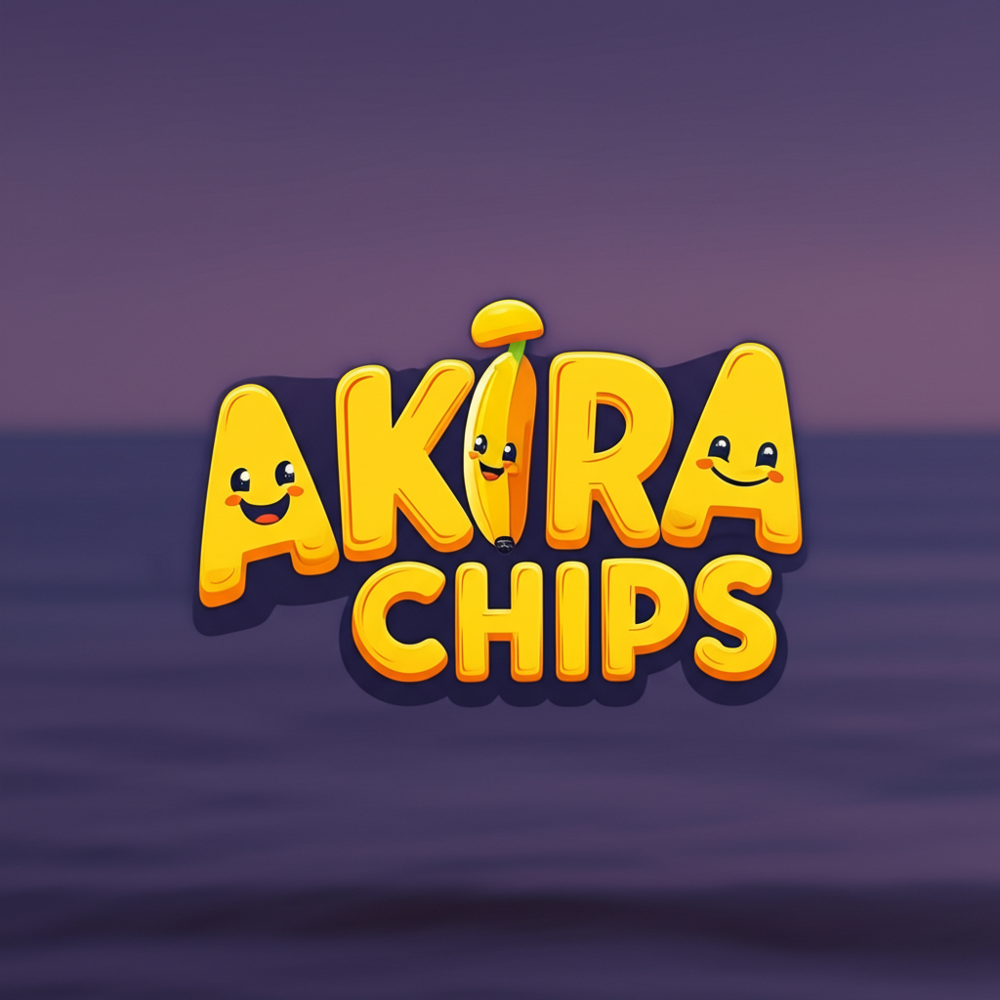

Muhammadabid7: buatin readme.md nya yang sangat bagus dan aeshtetic dan proffesional 

Workspace: Collecting workspace information```markdown

<div align="center">
  
  <br />
  <b style="font-size:2.5rem;letter-spacing:2px;animation: fadeIn 2s cubic-bezier(.4,0,.2,1) forwards;">Akira Potato</b>
  <br />
  <span style="display:inline-block;margin-top:8px;font-style:italic;font-size:1.1rem;animation: fadeInUp 1.5s 0.5s cubic-bezier(.4,0,.2,1) forwards;opacity:0;">
    Healthy Banana Chips & More — Modern, Responsive, and Delightfully Crafted
  </span>
  <br /><br />
  
  <br />
  
  
  
  
</div>

<!-- Animasi CSS untuk efek pada logo dan teks -->
<style>
@keyframes float {
  0% { transform: translateY(0); }
  100% { transform: translateY(-18px); }
}
@keyframes fadeIn {
  from { opacity: 0; }
  to { opacity: 1; }
}
@keyframes fadeInUp {
  from { opacity: 0; transform: translateY(30px); }
  to { opacity: 1; transform: translateY(0); }
}
</style>

---

## ✨ Features

- ⚡️ Built with **Next.js 13** & **TypeScript**
- 🎨 Modern UI with custom components
- 🌙 Dark mode support (toggle in header)
- 📱 Fully responsive & mobile-friendly
- 🧩 Modular component structure
- 🥑 Easy to customize & extend

---

## 📂 Project Structure

```
akira-potato/
├── app/                # Next.js app directory
│   ├── globals.css     # Global styles
│   ├── layout.tsx      # Root layout
│   └── page.tsx        # Main page
├── components/         # Reusable components
│   ├── theme-provider.tsx
│   ├── theme-toggle.tsx
│   └── ui/             # UI primitives (e.g., Input)
├── hooks/              # Custom React hooks
├── lib/                # Utility functions
├── public/             # Static assets (images, logo, etc.)
├── styles/             # Additional styles
├── package.json        # Project metadata & scripts
└── readme.md           # This file
```

---

## 🚀 Getting Started

1. **Clone the repository**
   ```sh
   git clone https://github.com/your-username/akira-potato.git
   cd akira-potato
   ```

2. **Install dependencies**
   ```sh
   pnpm install
   ```

3. **Run the development server**
   ```sh
   pnpm dev
   ```

4. **Open in your browser**
   ```
   http://localhost:3000
   ```

---

## 🛠️ Scripts

| Command         | Description                |
|-----------------|---------------------------|
| `pnpm dev`      | Start development server  |
| `pnpm build`    | Build for production      |
| `pnpm start`    | Start production server   |
| `pnpm lint`     | Run linter                |

---

## 🌈 Customization

- Update images in [`public/`](public/) for your own branding.
- Edit UI components in [`components/`](components/) to fit your needs.
- Modify theme and styles in [`app/globals.css`](app/globals.css) and [`components/theme-provider.tsx`](components/theme-provider.tsx).

---

## 🤝 Contributing

Contributions, issues and feature requests are welcome!  
Feel free to check [issues](https://github.com/your-username/akira-potato/issues) page.

---

## 📄 License

This project is licensed under the MIT License.

---


<div align="center" style="margin-top:32px;">
  
  <br />
  <span style="font-size:1.2rem;font-weight:bold;letter-spacing:1px;animation: fadeInUp 1.5s 1s cubic-bezier(.4,0,.2,1) forwards;opacity:0;">
    Akira Potato — Taste the Crunch, Enjoy the Health!
  </span>
</div>
